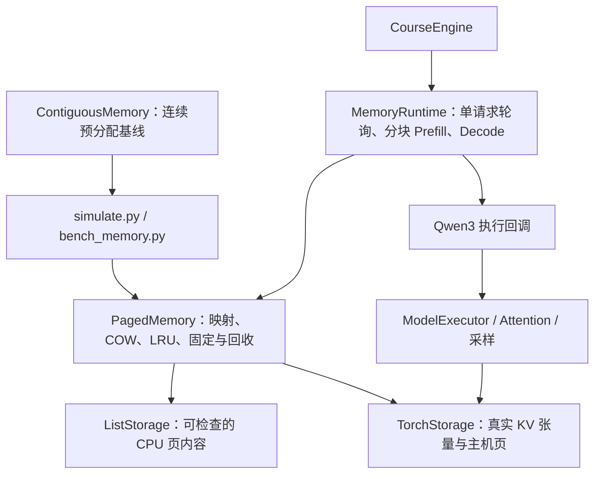
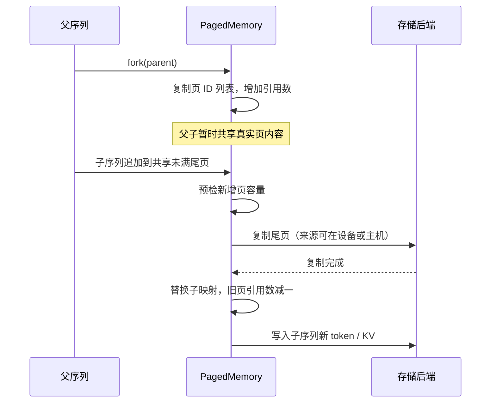
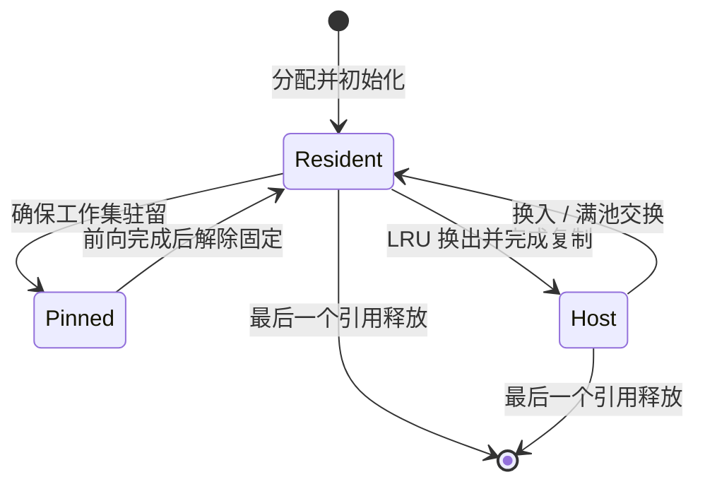
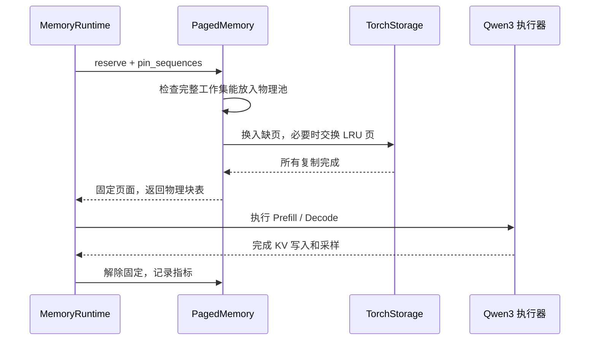

# 系统设计：KV Cache 分页内存管理

## 1. 从上下文到地址空间

每条请求都有自己的上下文，可以把它看作一个独立的地址空间。生成新 token 时扩展空间，创建分支时共享已有内容，显存不足时换出暂时不用的页。这几种操作分别对应操作系统中的动态分配、fork/COW 和页面置换。

| 操作系统概念 | 本项目对象 | 代码位置 |
|---|---|---|
| 进程地址空间 | 每条序列的页 ID 列表和有效长度 | `AddressSpace` |
| 页表与地址转换 | token 下标 → 逻辑页 ID → 驻留 frame + offset | `PagedMemory.translate` |
| 物理页框与空闲链表 | GPU 块池 / CPU 仿真页池和 free_frames | `PagedMemory`、存储后端 |
| fork 与写时复制 | 引用计数共享，首次写入复制受影响页 | `fork`、`_make_private` |
| 缺页与置换 | 主机页换入；未固定页中选择最久未访问者 | `ensure_resident`、`_victim` |
| 页固定 | 前向计算期间保护完整 KV 工作集 | `pin_sequences` |
| 交换空间 | 有界 host_pages，满池换入复用被换入页的主机槽位 | `ListStorage`、`TorchStorage` |

这些机制都在用户态实现：页表由 Python 对象维护，访问主机上的页时，由运行器负责换入。

## 2. 模块结构

`src/memory/` 将页表管理和数据存储分开。管理核心不依赖 PyTorch/CUDA；`ListStorage` 用 Python 列表保存页内容，方便测试；`TorchStorage` 操作形状为 `[2, L, N, S, H_kv, d]` 的 KV 张量池，负责页复制和 CPU/GPU 搬运。

`CourseEngine` 复用 `src/control/engine.py` 创建的模型、KV 池和执行器，由 `MemoryRuntime` 驱动请求并管理物理块表。这条路径独占 KV 池的分配权，原调度器不参与页面管理。普通推理使用 `run.py`，换页验证使用 `test/validate_gpu.py`。

验证时每轮只执行一个请求，使用 eager 和贪心采样，关闭编译。几种内存策略因此可以在相同的执行条件下比较；持续批处理、CUDA Graph 和编译的性能由单独的基准测试衡量。

## 3. 地址与所有权

页大小为 S 时，逻辑 token 地址 i 分解为 `(i // S, i % S)`。序列页表存储稳定逻辑页 ID，页面对象再记录当前物理 frame 或主机槽位。换页改变驻留位置，共享引用仍指向同一个逻辑页。

`check_invariants()` 检查以下约束：

- 页面引用数等于所有序列页表中该 ID 出现的次数。
- 活跃页恰有一种驻留位置；固定页必须在设备上。
- 活跃物理页和空闲物理页不重叠，合起来恰好覆盖物理池；主机池同理。
- 序列页数等于 `ceil(length / S)`，页内有效长度与映射一致。

页表操作按单线程顺序执行。请求结束后，引用归零的页立即回收；只有仍被请求使用的前缀会留在池中。

## 4. fork 与 COW 时序

尾页已满时，追加只分配新页；改写已有共享页时，复制该页。复制页在完成前不会替换旧映射。`reserve` 的多页增长发生后端异常时会回滚逻辑所有权和新增页；此前完成的换页可能改变驻留位置，但原序列内容仍保留。设备故障导致 CUDA 上下文不可用时，需要终止本次推理。

## 5. 页状态与换入时序

LRU 只在未固定的设备页中选择，按最近访问序号和页 ID 确定性排序。如果所有候选页都已固定、主机池耗尽，或单次 Attention 的工作集过大，就返回容量错误。

主机满池时，后端临时保存被换出页，加载目标页到其物理 frame，再用原主机槽位保存被换出页。这一步需要额外一页主机临时缓冲区（scratch），其字节数会记录在报告中。

搬运方法会等待复制完成后再返回，随后才允许复用页面或开始计算。目前采用同步复制，尚未实现搬运与计算重叠。

## 6. 容量边界

主机换页扩展不同请求可保存的总上下文。一轮 Attention 仍需完整历史 KV 驻留；例如物理池只能容纳 32 token 时，64-token 单请求不能靠主机换页完成。这属于当前 Attention 接口的限制。

分配失败的请求会结束，并在结果中记录原因。连续基线按声明的最大长度预留空间，支持相邻空闲区合并；分页则按需增长。两者既有布局差别，也有预留策略差别，具体对照见评测报告。

验证结果见[评测报告](02-量化评测报告.md)，复现入口见[复现与演示](04-复现与演示.md)。
