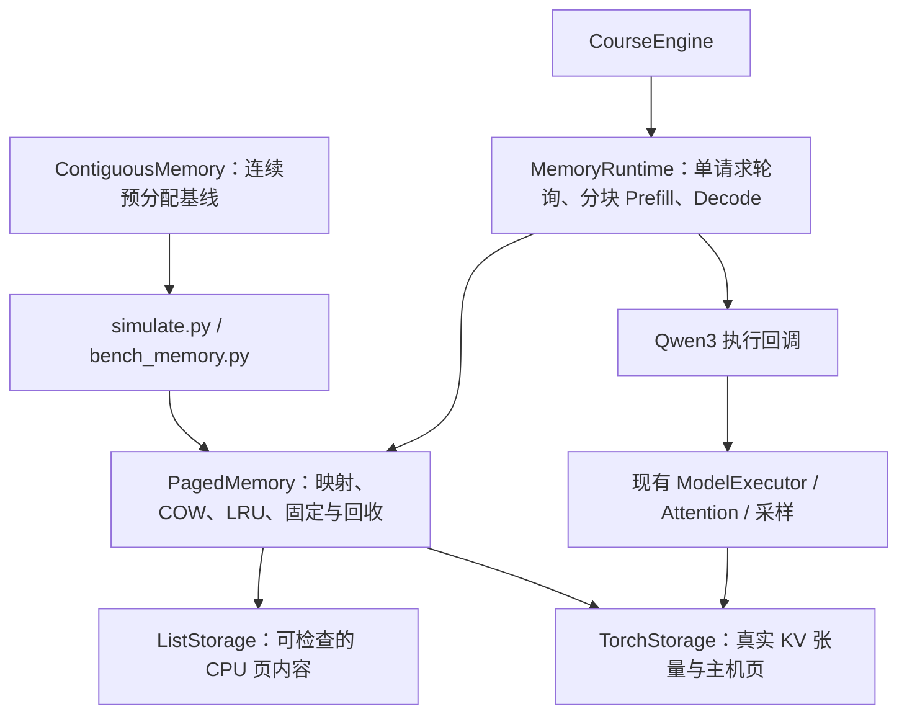
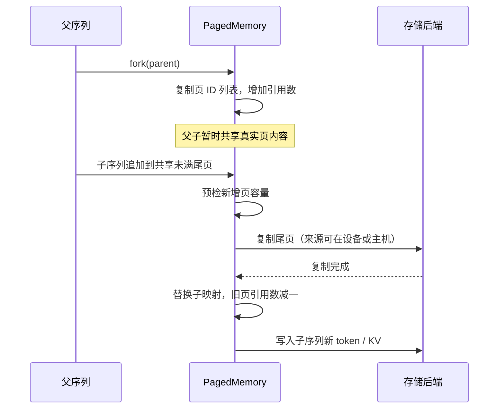
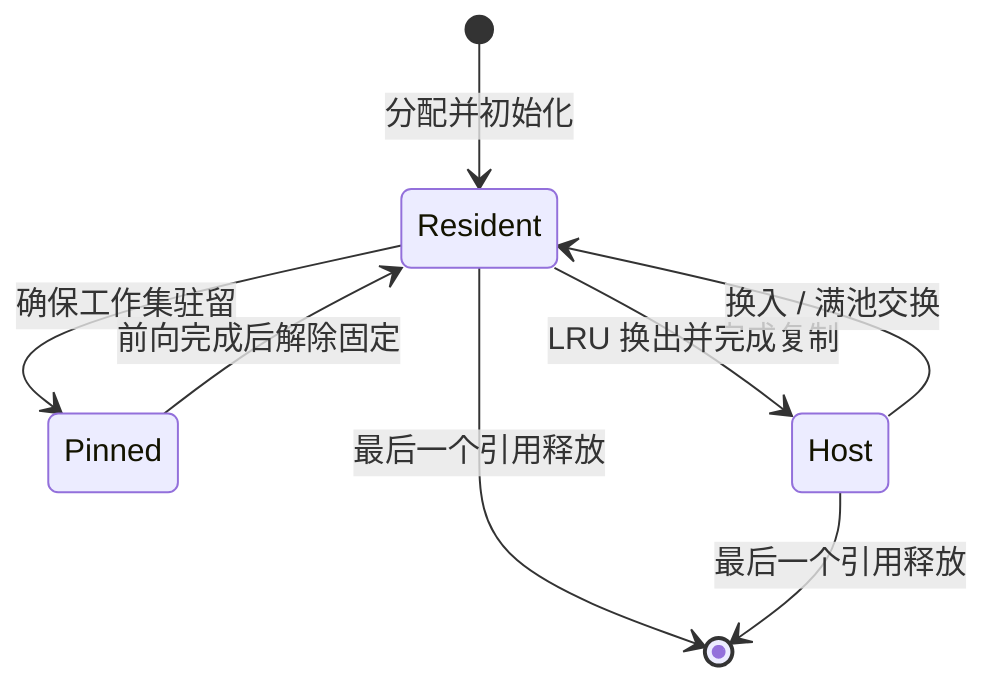
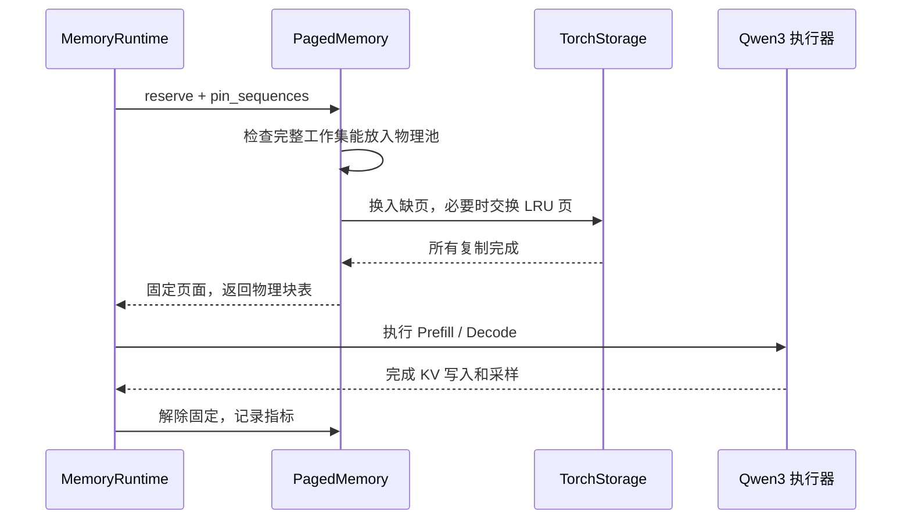

# 系统设计：KV Cache 分页内存管理

## 1. 目标与 OS 概念映射

对应根目录任务书中的任务一。把请求上下文视为地址空间，由逻辑页表定位物理 KV 块；按需增长、共享前缀、写时复制和 LRU 换页共用同一套 Python 管理逻辑。

| 操作系统概念 | 本项目对象 | 代码位置 |
|---|---|---|
| 进程地址空间 | 每条序列的页 ID 列表和有效长度 | `AddressSpace` |
| 页表与地址转换 | token 下标 → 逻辑页 ID → 驻留 frame + offset | `PagedMemory.translate` |
| 物理页框与空闲链表 | GPU 块池 / CPU 仿真页池和 free_frames | `PagedMemory`、存储后端 |
| fork 与写时复制 | 引用计数共享，首次写入复制受影响页 | `fork`、`_make_private` |
| 缺页与置换 | 主机页换入；未固定页中选择最久未访问者 | `ensure_resident`、`_victim` |
| 页固定 | 前向计算期间保护完整 KV 工作集 | `pin_sequences` |
| 交换空间 | 有界 host_pages，满池换入复用被换入页的主机槽位 | `ListStorage`、`TorchStorage` |

这里借用 OS 的管理机制；用户态 Python 对象不是硬件 MMU 页表，也没有实现操作系统缺页异常。

## 2. 模块结构

管理核心位于 `src/memory/`，导入核心包不依赖 PyTorch/CUDA。`ListStorage` 用 Python 数据模拟页内容，测试可以核对父子分支是否相互污染。`TorchStorage` 接受 `[2, L, N, S, H_kv, d]` 的真实 KV 池，在 GPU 路径执行设备内复制以及 CPU/GPU 搬运。

`CourseEngine` 复用 `src/control/engine.py` 创建的模型、KV 张量池与执行器，通过课程运行器分配物理块表。它不同时调用原调度器管理这些页，避免两个分配器竞争同一池。`run.py` 保留原推理演示入口；课程换页验证入口为 `test/validate_gpu.py`。

课程运行器每轮执行一个请求，固定 eager、无编译、贪心采样。这样可以在相同执行规则下对照内存策略。原持续批处理、CUDA Graph 和编译路径不属于本次分页收益结论。

## 3. 地址与所有权

页大小为 S 时，逻辑 token 地址 i 分解为 `(i // S, i % S)`。序列页表存储稳定逻辑页 ID，页面对象再记录当前物理 frame 或主机槽位。换页改变驻留位置，共享引用仍指向同一个逻辑页。

每一步通过 `check_invariants()` 核对：

- 页面引用数等于所有序列页表中该 ID 出现的次数。
- 活跃页恰有一种驻留位置；固定页必须在设备上。
- 活跃物理页和空闲物理页不重叠，合起来恰好覆盖物理池；主机池同理。
- 序列页数等于 `ceil(length / S)`，页内有效长度与映射一致。

当前 API 为单线程顺序运行，没有并发修改页表的锁协议。请求结束后引用归零的页立即回收，不额外保存无人引用的前缀缓存。

## 4. fork 与 COW 时序

尾页已满时，追加只分配新页；改写已有共享页时，复制该页。复制页在完成前不会替换旧映射。`reserve` 的多页增长发生后端异常时会回滚逻辑所有权和新增页；此前完成的换页可能改变驻留位置，但原序列内容仍保留。不可恢复的设备故障需要终止本次推理，不能仅靠页表回滚保证 CUDA 上下文恢复。

## 5. 页状态与换入时序

LRU 只在未固定的设备页中选择，按最近访问序号和页 ID 确定性排序。所有候选页被固定、主机池耗尽或单次 Attention 工作集过大时返回明确容量错误。

主机满池时，后端临时保存被换出页，加载目标页到其物理 frame，再用原主机槽位保存被换出页。张量后端因此最多需要额外一页主机 scratch；这不是额外 GPU 页，字节数会记录在报告中。

所有搬运在方法返回前完成。当前没有异步搬运与计算重叠，不会将“已提交复制”视为“复制完成”。

## 6. 容量边界

主机换页扩展不同请求可保存的总上下文。一轮 Attention 仍需完整历史 KV 驻留；例如物理池只能容纳 32 token 时，64-token 单请求不能靠主机换页完成。这属于当前 Attention 接口的限制。

模拟器和运行器对容量失败结束请求，避免无限重试。CPU 容量拒绝与真实 CUDA OOM 单独记录。连续基线按声明最大长度预留，并支持空闲区合并；其预留策略与分页按需增长同时不同，报告明确说明这项对照的解释边界。

验证结果见[评测报告](02-量化评测报告.md)，复现入口见[复现与演示](04-复现与演示.md)。
