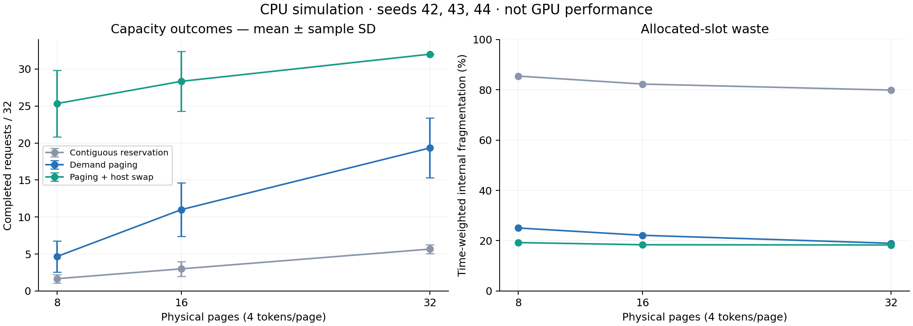
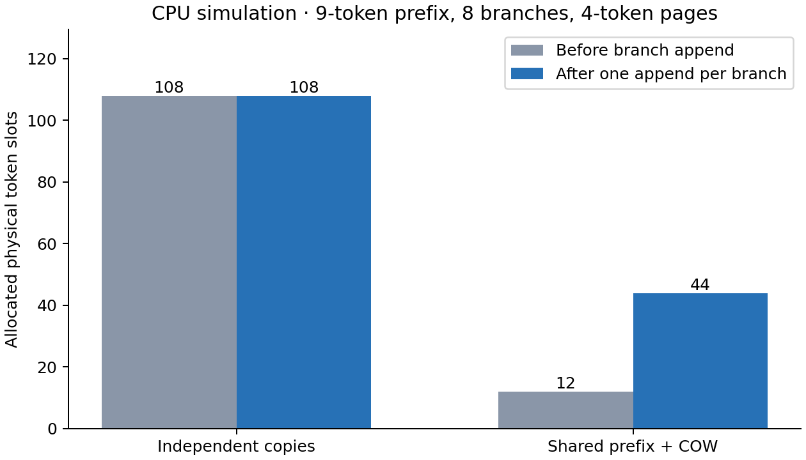

# KV Cache 分页内存管理量化评测报告

## 1. 结果范围

本报告来自 129 组实际执行的 CPU 确定性仿真，以及共享分支和外部碎片实验。原始运行时间为 `2026-09-15T11:24:02.230853+00:00`，Python `3.14.0`。

**当前没有 RTX 4060 Laptop 的 CUDA/Qwen3 实测结果。** CPU 容量拒绝不是 CUDA OOM，仿真 tick 不是设备时间。吞吐、实际显存峰值和换页耗时须以 GPU 验证报告补充。

原始记录：[`raw.json`](../experiments/task1/raw.json)、[汇总 CSV](../experiments/task1/summary.csv)。原始记录包含负载、每步指标、提交号、工作区状态和源码 SHA-256；源码哈希用于识别运行时尚未提交的代码。

## 2. 实验设计

- 混合负载：32 条请求，每 tick 到达 4 条，实际长度为 3～20 token，连续基线按每条 32 token 预留。种子为 42、43、44。扫描页大小 2/4/8，物理页数 8/16/32，共 81 组。
- 容量扫描：并发 4/8/16/32、长度 8/16/32/64，物理 8 页、每页 4 token，连续基线按每条 64 token 预留，共 48 组。
- 三种策略共用负载和轮询顺序。容量分配失败立即结束该请求，不通过无限等待掩盖失败。
- 换页策略额外使用主机页池：混合负载 32 页、容量扫描 64 页。它扩展可保存的上下文总量，但一次 Attention 的完整工作集仍必须放入物理页池。
- 此基线同时体现最大长度预留和连续布局两种因素，不能把全部收益单独归因于消除外部碎片。不同策略拒绝的请求不同，碎片指标也受存活请求集合影响。

## 3. 混合负载结果

以下取每页 4 token，展示三个种子的均值。完成数误差为样本标准差；碎片率先按各运行的分配槽位乘时间加权，再对三个种子取均值。换页模式的分配槽位包括 GPU 与主机上的唯一页。

| 物理页数 | 策略 | 完成请求 /32 | 容量拒绝比例 | 内部碎片率 | 平均换入页次 |
|---:|---|---:|---:|---:|---:|
| 8 | 连续预分配 | 1.67 ± 0.58 | 94.8% | 85.4% | 0.0 |
| 8 | 按需分页 | 4.67 ± 2.08 | 85.4% | 25.1% | 0.0 |
| 8 | 分页与主机换页 | 25.33 ± 4.51 | 20.8% | 19.3% | 492.0 |
| 16 | 连续预分配 | 3.00 ± 1.00 | 90.6% | 82.3% | 0.0 |
| 16 | 按需分页 | 11.00 ± 3.61 | 65.6% | 22.1% | 0.0 |
| 16 | 分页与主机换页 | 28.33 ± 4.04 | 11.5% | 18.4% | 566.7 |
| 32 | 连续预分配 | 5.67 ± 0.58 | 82.3% | 79.8% | 0.0 |
| 32 | 按需分页 | 19.33 ± 4.04 | 39.6% | 19.0% | 0.0 |
| 32 | 分页与主机换页 | 32.00 ± 0.00 | 0.0% | 18.3% | 476.7 |



在这组负载和容量条件下，按需分页减少了最大长度预留的浪费。主机换页提高了完成数，同时产生数百页次的数据搬运。这里没有带宽和算力时间模型，因此不能据此得出延迟更低或 tokens/s 更高的结论。

## 4. 共享与写时复制

父序列有 9 个有效 token，页大小为 4，创建 8 个分支，保留父序列。每个分支再追加 1 个不同 token，并核对父子内容互不污染。

| 模式 | 分支写入前分配槽位 | 写入后分配槽位 | COW 页复制数 |
|---|---:|---:|---:|
| 独立复制 | 108 | 108 | 0 |
| 共享与 COW | 12 | 44 | 8 |

本例分支写入后，COW 相对独立复制节省 59.3% 的物理分配槽位。复制只发生在未满尾页，完整公共前缀仍共享。这个比例取决于前缀长度、页大小和分支数。



## 5. 外部碎片与工作集边界

连续基线形成 `[空闲4][占用4][空闲4]` 布局后，空闲总量为 8，最大连续区为 4，申请 5 个连续槽位失败。释放中间区后合并为长度 12 的空闲区。该用例独立验证外部碎片与合并行为。

容量扫描中，64-token 请求超过 32-token 物理工作集上限，即使主机有空间也不能完成。当前 Attention 接口需要完整历史 KV 驻留，换页只能让不同请求轮流驻留，不能让单次 Attention 跨主机分页执行。

## 6. 正确性与覆盖率

运行 `.venv-cpu/bin/python test/run_cpu.py --coverage` 获得纯 CPU 测试及覆盖率；含 PyTorch 的环境还会执行实际 CPU 张量后端测试。覆盖范围包含 `src/memory`，GPU 专用未执行行会降低总覆盖率，不从统计中隐藏。

测试覆盖页表边界、回收、失败回滚、随机生命周期、fork/COW、LRU、主机满容量交换、工作集固定、回调失败和空输出请求。检查页引用数与映射数一致、页归属唯一、回收后池容量恢复。

归档证据：[纯 CPU 测试摘要](../experiments/task1/tests-cpu/test_summary.json)、[CPU 张量测试摘要](../experiments/task1/tests-torch-cpu/test_summary.json)及同目录 coverage.json。前者 35 项中 32 项通过、3 项张量测试跳过，行覆盖率约 82%；后者 35 项全部通过，约 94%。核心管理模块行覆盖率 100%，不代表所有输入或 CUDA 路径均已验证。

## 7. GPU 验证计划与限制

运行 `bash scripts/validate_gpu.sh --model ~/huggingface/Qwen3-0.6B`。脚本记录设备与环境、输出 token、峰值 allocated/reserved、逐步页状态及搬运量。默认使用 4 个物理 KV 块与 16 个主机块，可通过参数调整。

充足显存配置用于输出正确性参考；固定物理容量的无换页与换页配置用于容量和性能对比。课程运行器采用单请求轮询，固定 eager 与贪心采样，避免混入组批和编译优化。它不代表现有持续批处理引擎的最大吞吐。

TorchStorage 的每次复制在返回前完成，同步保证易于验证；尚未实现异步拷贝与计算重叠。满容量交换临时需要一页主机 scratch，报告单独记录其字节数。

课程 GPU 长上下文、并发上限与实际 CUDA OOM 数据，真实对话轨迹补充实验，以及录屏仍待完成。不会将历史记录或仿真数字填入这些项目。

## 8. 复现

```bash
bash scripts/setup_cpu.sh
python3 bench/bench_memory.py
.venv-cpu/bin/python -m pip install -r requirements-report.txt
.venv-cpu/bin/python scripts/plot_memory.py
python3 scripts/report_memory.py
```

图表 PNG/SVG 与原始数据保存在 `experiments/task1/`。报告和图表均由脚本从原始结果重新生成。
